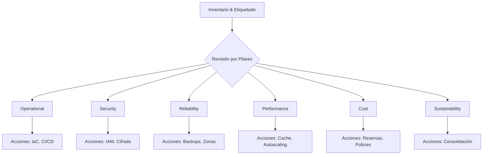

# Well-Architected Framework — Los 6 pilares de buenas prácticas

> [!abstract] Objetivo
> Esta nota resume los seis pilares del Well-Architected Framework (Operational Excellence, Security, Reliability, Performance Efficiency, Cost Optimization y Sustainability) con buenas prácticas, métricas clave y ejemplos prácticos para aplicar en arquitecturas cloud.

---

## 🎓 Contexto de Estudio

- **Área/Tema**: Nube / Arquitectura
- **Relevancia**: Guía para diseñar/criticar arquitecturas cloud (certificaciones, decisiones de diseño, revisiones operativas).
- **Dificultad percibida**: ⭐⭐⭐☆☆ Medio

---

## 📝 Definición

El Well-Architected Framework es un conjunto de principios, prácticas y herramientas para evaluar y mejorar cargas de trabajo en la nube. Originalmente definido por AWS, agrupa buenas prácticas en pilares que ayudan a minimizar riesgos, optimizar costes y mejorar sostenibilidad y rendimiento.

---

## ⚙️ Los 6 Pilares (resumen y buenas prácticas)

### 1) Operational Excellence (Excelencia Operacional)
- **Descripción**: Procedimientos, automatización y mejora continua para operar sistemas en producción.
- **Buenas prácticas**: definir runbooks, automatizar despliegues e infraestructuras (IaC), monitorizar SLOs y postmortems con acciones correctivas.
- **Métricas/Indicadores**: tasa de despliegues exitosos, MTTR, porcentaje de cambios automatizados.
- **Ejemplo**: pipelines CI/CD con pruebas automáticas y despliegue canario.

### 2) Security (Seguridad)
- **Descripción**: Proteger la confidencialidad, integridad y disponibilidad de los datos y servicios.
- **Buenas prácticas**: principio de menor privilegio, gestión de identidades (IAM), cifrado en tránsito y reposo, rotación de credenciales, detección y respuesta a incidentes.
- **Métricas/Indicadores**: número de hallazgos críticos, tiempo de detección, porcentaje de recursos con cifrado.
- **Ejemplo**: usar roles con permisos mínimos, escaneo de imágenes y WAF para APIs.

### 3) Reliability (Confiabilidad)
- **Descripción**: Capacidad de un sistema para recuperarse de fallos y continuar operando según lo esperado.
- **Buenas prácticas**: redundancia, failover automático, diseño sin punto único de fallo, pruebas de resiliencia (chaos engineering), backups y recuperación.
- **Métricas/Indicadores**: disponibilidad (SLA/SLO), RTO/RPO, tasa de fallos no planificados.
- **Ejemplo**: múltiples zonas de disponibilidad y health checks con autoscaling.

### 4) Performance Efficiency (Eficiencia de Rendimiento)
- **Descripción**: Uso eficiente de recursos para satisfacer requisitos de rendimiento.
- **Buenas prácticas**: elegir tipos de instancia adecuados, autoscaling basado en métricas relevantes, caching, arquitectura orientada a eventos y diseño serverless cuando conviene.
- **Métricas/Indicadores**: latencia p95/p99, utilización de CPU/memoria, coste por operación.
- **Ejemplo**: uso de CDN y caching en borde para reducir latencias globales.

### 5) Cost Optimization (Optimización de Costes)
- **Descripción**: Controlar y reducir costes sin sacrificar calidad de servicio.
- **Buenas prácticas**: dimensionamiento correcto, reservar capacidad cuando conviene, apagar entornos no usados, etiquetado para asignación de costes, optimizar almacenamiento y transferencias.
- **Métricas/Indicadores**: coste por entorno, coste por usuario/operación, porcentaje de recursos infrautilizados.
- **Ejemplo**: políticas automáticas que apagan entornos de desarrollo fuera de horario.

### 6) Sustainability (Sostenibilidad)
- **Descripción**: Minimizar impacto ambiental en el consumo energético asociado a cargas de trabajo en la nube.
- **Buenas prácticas**: optimizar uso de recursos, seleccionar regiones/servicios con huella energética menor, consolidación de cargas y elegir proveedores con energía renovable.
- **Métricas/Indicadores**: consumo energético estimado, eficiencia energética por operación, emisiones por unidad de trabajo.
- **Ejemplo**: consolidar jobs batch y ejecutar en ventanas con menor coste/huella energética.

---

## 💻 Ejemplo práctico — Checklist para revisión Well-Architected

- Preparación: inventario de recursos, etiquetas y owners.
- Operational: pipelines automáticos, runbooks y playbooks.
- Security: revisión IAM, cifrado, rotación de secrets, pruebas de pentest.
- Reliability: pruebas de failover, backups, RTO/RPO definidos.
- Performance: pruebas de carga p95/p99, caching, tuning infra.
- Cost: análisis coste por servicio, políticas de apagado y reservas.
- Sustainability: identificar cargas batch para consolidación y regiones eficientes.

---

## 💭 Reflexiones & Conexiones

- El marco es una herramienta de comunicación entre equipos (DevOps, seguridad, finanzas y producto).
- Priorizar mejoras según riesgo y coste: arreglar defectos críticos de seguridad y disponibilidad antes que microoptimizar costes.
- Integrar métricas en un dashboard para revisiones periódicas (SRE/CloudOps).

---

## 🎴 Flashcards

¿Cuáles son los 6 pilares del Well-Architected Framework?::Operational Excellence; Security; Reliability; Performance Efficiency; Cost Optimization; Sustainability

¿Qué mide MTTR?::Mean Time To Recovery — tiempo medio para recuperar un servicio tras un fallo

¿Qué práctica reduce latencia para usuarios globales?::Usar CDN y caching en el borde

---

## 📚 Referencias & Enlaces

- AWS Well-Architected Framework — https://aws.amazon.com/architecture/well-architected/
- Artículo sobre Sustainability en cloud — https://aws.amazon.com/es/what-is/sustainability/

---

## 📋 Metadata

- **Estado**: 🌿 Creciendo
- **Última revisión**: 2026-08-07
- **Próxima revisión**: 2026-08-14
- **Veces revisado**: 1
- **Nivel de comprensión**: 🤔 Entiendo parcialmente
- **Tiempo estimado de repaso**: 15min

> [!tip] Próximos pasos
> - Ejecutar la checklist en una revisión de arquitectura y generar acciones priorizadas.

